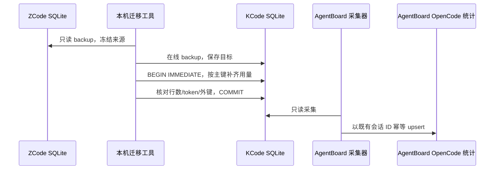

# KCode 统计接入与本机历史补齐

## 规则与所有者

- KCode/ZCode 的用量事实源是各自的 `cli/db/db.sqlite`。采集器只读数据库，不负责迁移。
- 未配置覆盖路径时，优先读取存在的 `~/.kcode/cli/db/db.sqlite`；只有 KCode 主库不存在时才读取 ZCode。`-wal`/`-shm` 的存在或时间不能决定所有权，读取旧库也可能刷新 `-shm`。
- 路径覆盖顺序：`AGENTBOARD_KCODE_DB`、`AGENTBOARD_ZCODE_DB`、config 的 `kcode_db_path`、`zcode_db_path`、默认探测。保留旧配置的兼容性；显式覆盖不存在时报告读取失败，不偷偷换库。
- KCode 继续使用 `source=opencode`、`opencode:zcode:<session_id>` 和既有同步状态文件。改名不会创建第二份会话，不改变 token 口径，不触发版本全量重发。
- Windows 计划任务通过 `pythonw.exe` 静默运行时，`sys.stderr` 可以为 `None`；日志仍落盘，不能因终端检测异常中断采集。

## 本机补齐边界

- 先用 SQLite backup API 保存 ZCode 来源快照及 KCode 目标备份；不直接复制正在写入的主库/WAL。
- 只补齐 `model_usage`、`turn_usage`、`tool_usage` 中目标不存在的主键。复合主键按全部字段判断。保留目标已有行和新增列默认值。
- 每条用量所属的 session 必须已存在于 KCode。共享行的核心数值不一致、唯一约束冲突或外键缺失时停止，整个事务回滚。
- 不迁移消息正文、配置、任务或凭据。重复执行应新增零行。迁移脚本及备份留在本机，不纳入 Git。
- 本机 AgentBoard 显式选择合并后的 KCode 数据库，避免残留旧配置继续采集 ZCode。
- 当前 KCode 会在写入用量后清理超过 30 天的记录。一次性补齐无法改变此保留规则；长期历史保留需要另行调整 KCode，不能声称补齐后永久保存。

## 顺序

## 验收

1. 仅 KCode、仅 ZCode、二者同时存在、二者都不存在的默认路径均符合规则。
2. 旧库主库和 `-shm` 时间较新也不能抢占已有 KCode；孤立 sidecar 不视为数据库。
3. 新旧环境变量和配置覆盖保持上述优先级。
4. SQLite 用量采集保留原会话 ID、token 口径和 `source=opencode`；重复同步无变化不再上传。
5. 本机迁移后旧库三张用量表无缺失主键；目标原有行不被覆盖，重复执行新增零行。
6. `sys.stderr=None` 时，Windows 静默采集仍可写日志。
